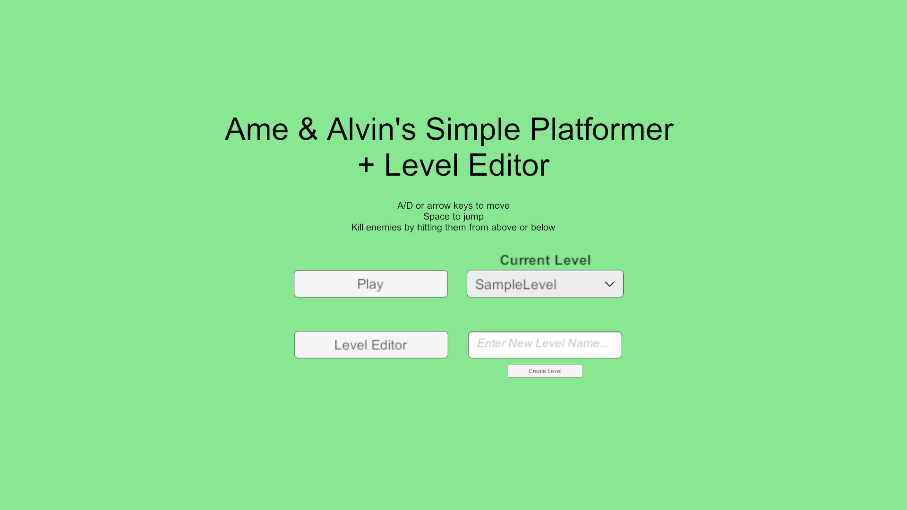
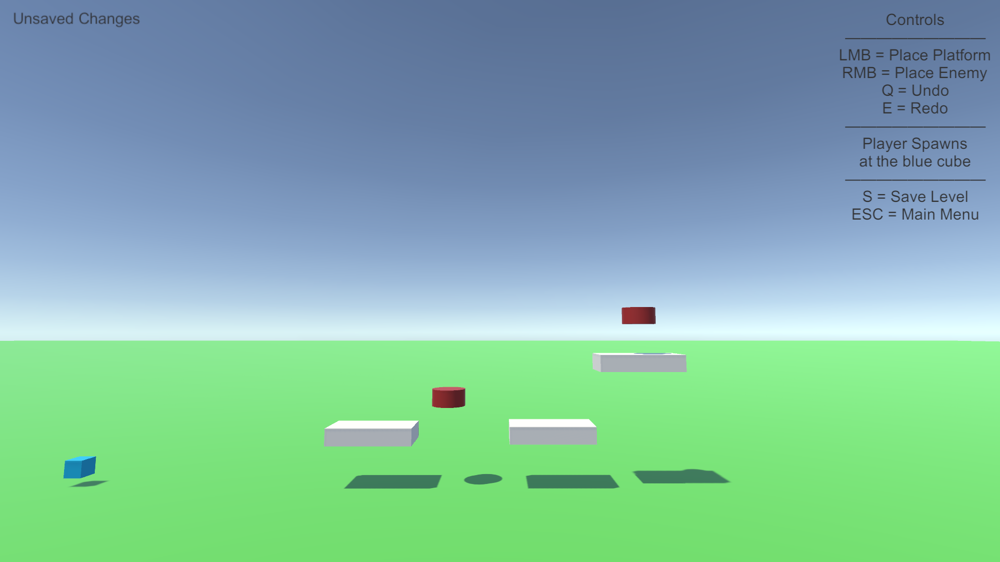
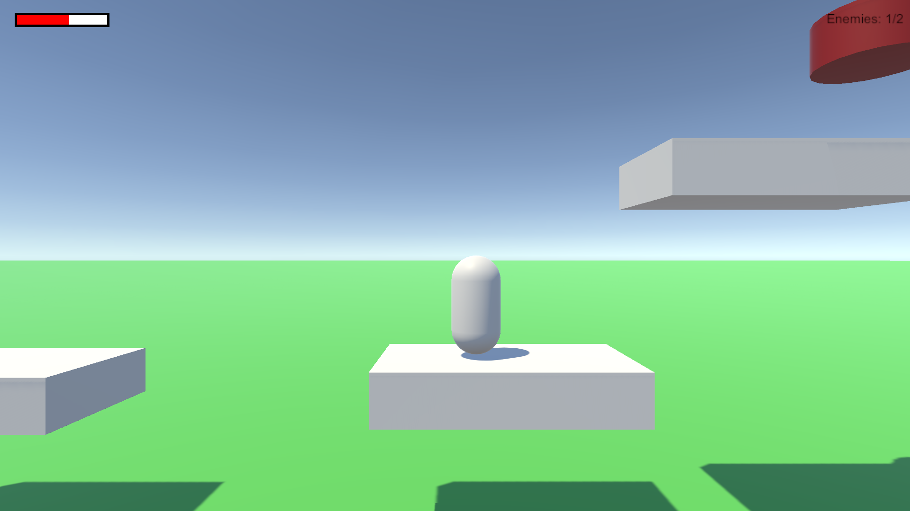
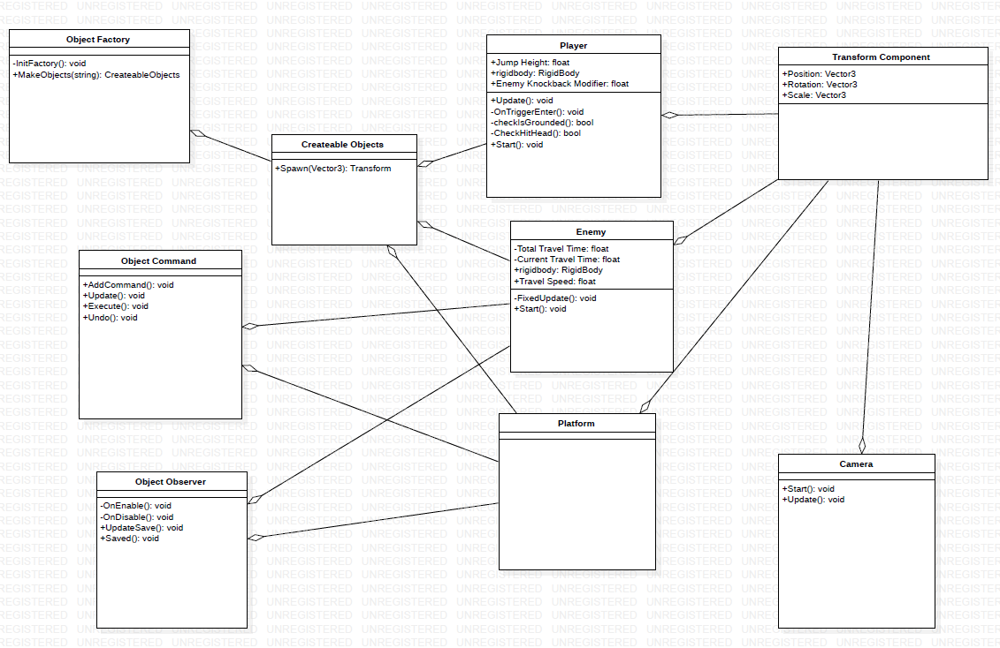

# INFR 3310U - Game Engine Design And Implementation Assingment 2

### Level Editor - By Ame Gilham (100741352) and Alvin Ng (‌100754129)

### Game Description

A simple platformer where the player can defeat enemies from above or below and jump around on platforms. 
The enemies travel back and forth in a line, the player wins by defeating all of the enemies. 
From the main men there is a level editor the player can use to make levels, if no levels are found in the
files it will generate an empty level by default.

### Screenshots

### Demo Video

Youtube link: [https://youtu.be/USZUQjtvepA](https://youtu.be/USZUQjtvepA "Youtube")
Hubs Room: [https://hubs.mozilla.com/zqJdReB/atlas-x-games-subgroup-2-assignment-2-room/](https://hubs.mozilla.com/zqJdReB/atlas-x-games-subgroup-2-assignment-2-room/ "Mozilla")

### Developement Team

Atlas X Games - SubGroup 2
Ame Gilham - 100741352 - Developer/Programmer
Alvin Ng - 100754129 - Technical Artist

### UML Diagram

### Third-Party acknowledgement

No Third-Party art or sound assets were used

Some code was reused from in class tutorial content
Additionally the following videos were referenced 
while coding some of the features:

Popup: [https://youtu.be/Bm62aXuVX4I](https://youtu.be/Bm62aXuVX4I "Youtube") 
Factory: [https://youtu.be/FGVkio4bnPQ](https://youtu.be/FGVkio4bnPQ "Youtube")
Observer: [https://youtu.be/UWMmib1RYFE](https://youtu.be/UWMmib1RYFE "Youtube")
